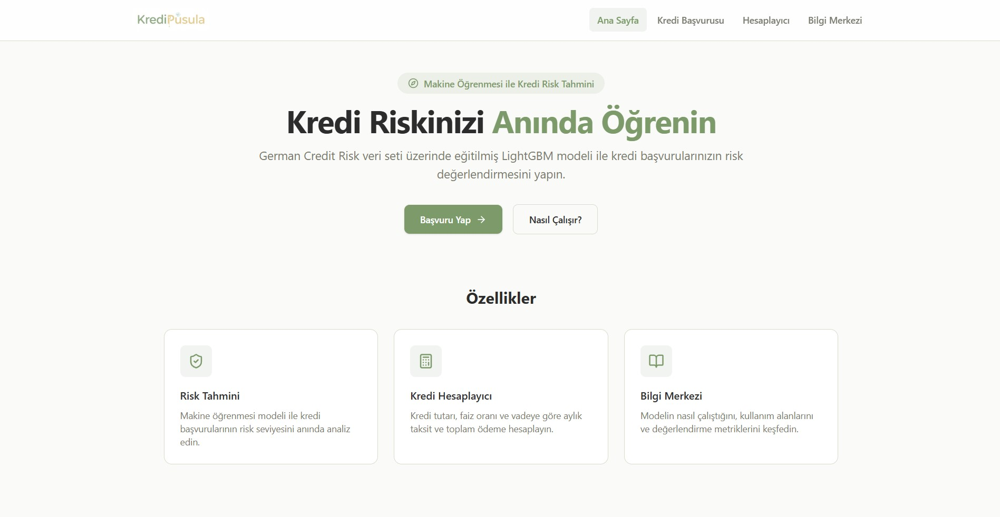

# HSD AGÜ From Model to Agent Mini Bootcamp

Machine Learning temellerinden başlayarak MLOps pratikleri ve Generative AI entegrasyonuna kadar uzanan 3 haftalık yoğun eğitim programı.

---




## Proje Genel Bakış

**KrediPusula** - Kullanıcıların kredi uygunluğunu analiz eden, kişiselleştirilmiş kredi önerileri sunan ve yapay zeka destekli asistan ile 7/24 destek sağlayan akıllı kredi danışmanlık platformu.

**Canli Demo:** [kredipusula.onrender.com](https://kredipusula.onrender.com)

## Haftalik Plan

- **Hafta 1:** AI/Ml Temelleri - Kredi risk tahmin modeli
- **Hafta 2:** MLOps - REST API, deployment ve monitoring 
- **Hafta 3:** GenAI Temelleri - Generative temelli müşteri destek botu

### Tech Stack

| Kategori | Teknolojiler |
|----------|-------------|
| **Data & ML** | NumPy, Pandas, Matplotlib, Seaborn, scikit-learn, XGBoost, LightGBM, CatBoost |
| **Tuning & Tracking** | Optuna, MLflow |
| **Backend** | FastAPI, Uvicorn |
| **Frontend** | React, TypeScript, Tailwind CSS, Vite |
| **LLM** | Google GenAI SDK (Gemini) |
| **Deployment** | Render.com |

## Repository Yapisi

```
hsd_agu_egitim/
├── data/
│   └── german_credit_data.csv        # German Credit Risk veri seti
│
├── notebooks/
│   ├── 01_eda.ipynb                  # Kesifci veri analizi
│   ├── 02_baseline.ipynb             # Baseline model egitimi ve karsilastirma
│   └── 03_feature_engineering.ipynb  # FE, tuning, threshold optimizasyonu
│
├── models/
│   └── lightgbm_tuned_pipeline.pkl   # Egitilmis LightGBM pipeline
│
├── src/
│   ├── backend/                      # FastAPI REST API
│   │   ├── main.py                   # Uygulama giris noktasi, endpointler, CORS
│   │   ├── model.py                  # Model yukleme ve tahmin
│   │   ├── schemas.py                # Pydantic veri semalari
│   │   ├── feature_eng.py            # Feature engineering (inference)
│   │   └── README.md                 # Backend dokumantasyonu
│   │
│   └── frontend/                     # React + TypeScript web uygulamasi
│       ├── src/
│       │   ├── components/           # Navbar, Footer, CreditForm, ResultCard, Calculator
│       │   ├── pages/                # HomePage, ApplyPage, CalculatorPage, InfoPage
│       │   └── lib/                  # API katmani, yardimci fonksiyonlar
│       ├── package.json
│       └── README.md                 # Frontend dokumantasyonu
│
├── docs/
│   ├── week1/README.md               # Hafta 1 ders notlari
│   ├── week2/README.md               # Hafta 2 ders notlari
│   ├── week3/README.md               # Hafta 3 ders notlari
│   └── deployment.md                 # Deployment rehberi
│
├── requirements.txt                  # Production Python bagimliliklari
├── pyproject.toml                    # Gelistirme bagimliliklari (uv)
└── .gitignore
```

## Hizli Baslangic

```bash
# 1. Repository'yi klonla
git clone https://github.com/Turkish-AI-Community/hsd-agu-egitim.git
cd hsd-agu-egitim

# 2. Python bagimliklarini yukle
uv sync

# 3. Backend'i baslat
uv run uvicorn src.backend.main:app --reload

# 4. Frontend'i baslat (ayri terminal)
cd src/frontend
npm install
npm run dev
```

Backend: `http://localhost:8000` | Frontend: `http://localhost:5173`

> Deployment detaylari icin [docs/deployment.md](docs/deployment.md) dosyasina bakin.

## Dokumantasyon

- [Hafta 1 - ML Temelleri](docs/week1/README.md): EDA, model egitimi, metrikler, feature engineering
- [Hafta 2 - MLOps & Deployment](docs/week2/README.md): Monitoring, REST API, deployment, CI/CD
- [Hafta 3 - GenAI & Agent](docs/week3/README.md): LLM, prompt engineering, agent mimarileri
- [Deployment Rehberi](docs/deployment.md): Lokal, backend-only ve Render deployment

## Iletisim

| | |
|---|---|
| **Egitmen** | [](https://www.linkedin.com/in/enesfehmimanan/) [](https://github.com/enesmanan) [](https://x.com/enesfehmimanan) |
| **Topluluk** | [](https://www.linkedin.com/company/turkish-ai-community/) [](https://github.com/Turkish-AI-Community) [](https://x.com/turkiyeyz) |
